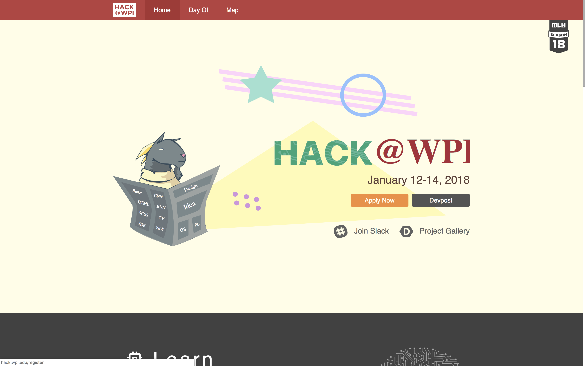
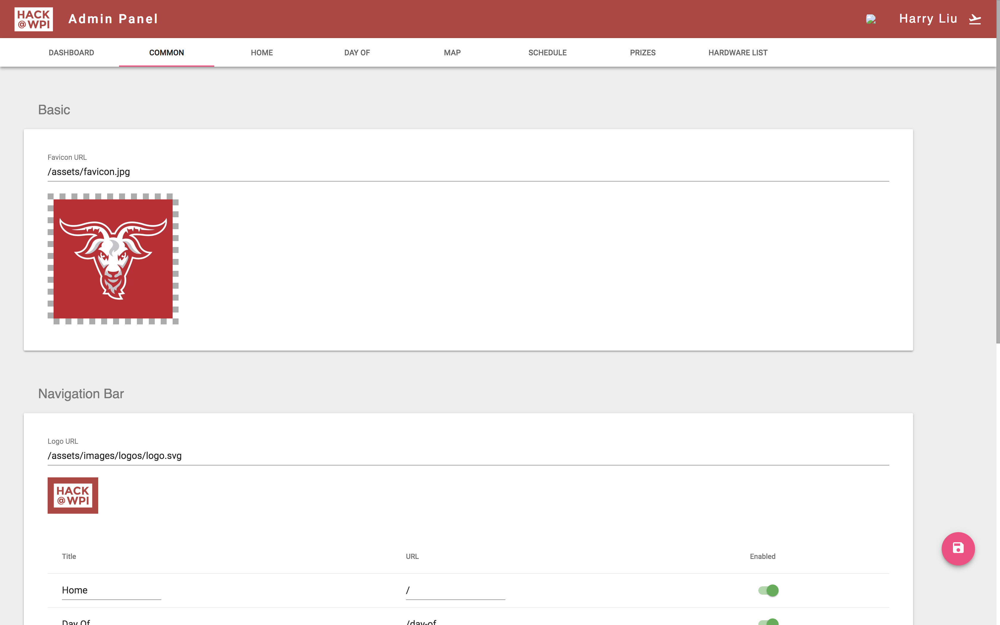

# HackWPI Frontend

## Preview
### Homepage

### Admin

## Customize

Edit `src/services/App.state.service.js` to edit the content of the site.

## Installation

Run `npm install`

## Running

Run `npm start`

## Building

Run `npm run build`

## Backend
You can find the backend [here](https://github.com/byliuyang/HackWPI)